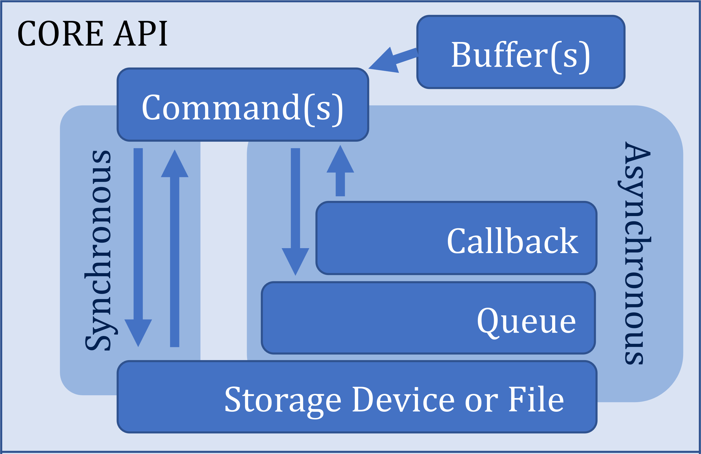

.. _sec-api:

#####
 API
#####

**xNVMe** provides ``libxnvme``, a systems-level library implemented
in :ref:`sec-api-c`, with library bindings available in :ref:`sec-api-python`
and :ref:`sec-api-rust`.

The :ref:`sec-api-c` section starts with technical details on using the library
header. It is followed by subsections that overview the :ref:`sec-api-c-core`
abstractions, and additional layers such as :ref:`sec-api-c-nvme`
and :ref:`sec-api-c-file`. It also includes supplemental helpers and convenience
functions found in :ref:`sec-api-c-cli` and :ref:`sec-api-c-util`, as well as
practical :ref:`sec-api-c-examples`.

.. _coreapi:

:ref:`sec-api-c-core`
  The encapsulates variation in system interfaces, drivers, transports, etc. and
  provides unified mechanics to:

  * Enumerate devices on a system and obtaining device handles
  
    - Including device identifiers and open options

  * Construct, submit and process **commands**
  
    - Synchronous/blocking
    - Asynchronous/non-blocking via a queue and callback primitive

  * Memory management primitives for command buffers

:ref:`sec-api-c-nvme`
  This section consists of the part of **xNVMe** that **strictly** adheres to
  **NVMe** specifications. This includes definitions of data structures for
  commands, identify-results, log pages, etc., as well as helpers to form
  commands, access, and pretty-print data structures.

:ref:`sec-api-c-file`
  This section describes file-related functionalities within **xNVMe**.

:ref:`sec-api-c-cli`
  This section covers the command-line interface (CLI) functionalities of
  **xNVMe**.

:ref:`sec-api-c-util`
  This portion covers :ref:`sec-api-c-util`, which consists of helpers
  and convenience functions for general applicability, such as ``XNVME_DEBUG``,
  wall-clock timers, library introspection for version and capabilities, etc.

In addition to navigating the **API** documentation via the navigation bars on
the left and right, the search box is a useful way to quickly look up a function
from the API. Additionally, the code uses doxygen-compatible descriptions for
your editor/LSP to conveniently pick up.

.. toctree::
   :maxdepth: 2
   :hidden:

   c/index
   python/index
   rust/index