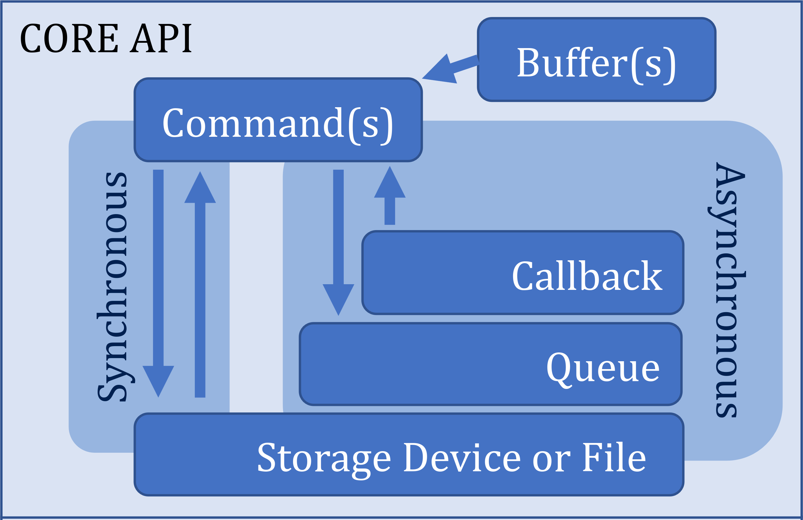

.. _sec-api:

#####
 API
#####

**xNVMe** provides ``libxnvme``, a systems-level library implemented
in :ref:`sec-api-c`, with library bindings available in :ref:`sec-api-python`
and :ref:`sec-api-rust`.

The :ref:`sec-api-c` section starts with technical details on using the library
header. It is followed by subsections that overview the :ref:`sec-api-c-core`
abstractions, and additional layers such as :ref:`sec-api-c-nvme`
and :ref:`sec-api-c-file`. It also includes supplemental helpers and convenience
functions found in :ref:`sec-api-c-cli` and :ref:`sec-api-c-util`, as well as
practical :ref:`sec-api-c-examples`.

.. _coreapi:

:ref:`sec-api-c-core`
  The encapsulates variation in system interfaces, drivers, transports, etc. and
  provides unified mechanics to:

  * Enumerate devices on a system and obtaining device handles
  
    - Including device identifiers and open options

  * Construct, submit and process **commands**
  
    - Synchronous/blocking
    - Asynchronous/non-blocking via a queue and callback primitive

  * Memory management primitives for command buffers

:ref:`sec-api-c-nvme`
  This section consists of the part of **xNVMe** that **strictly** adheres to
  **NVMe** specifications. This includes definitions of data structures for
  commands, identify-results, log pages, etc., as well as helpers to form
  commands, access, and pretty-print data structures.

:ref:`sec-api-c-file`
  This section describes file-related functionalities within **xNVMe**.

:ref:`sec-api-c-cli`
  This section covers the command-line interface (CLI) functionalities of
  **xNVMe**.

:ref:`sec-api-c-util`
  This portion covers :ref:`sec-api-c-util`, which consists of helpers
  and convenience functions for general applicability, such as ``XNVME_DEBUG``,
  wall-clock timers, library introspection for version and capabilities, etc.

:ref:`sec-api-c-gpu`
  Host-side queue management and device-side helpers for submitting NVMe
  commands directly from CUDA kernels, available with the ``upcie-cuda``
  backend.

In addition to navigating the **API** documentation via the navigation bars on
the left and right, the search box is a useful way to quickly look up a function
from the API. Additionally, the code uses doxygen-compatible descriptions for
your editor/LSP to conveniently pick up.

.. _sec-api-thread-safety:

Thread Safety
=============

xNVMe is not a thread-safe library. What it provides is narrower: a set of
control-plane calls is serialised with respect to each other by one
process-wide lock, so these may be made from several threads at once, on any
backend. They carry the note *Control plane*:

* ``xnvme_dev_open()``, ``xnvme_dev_close()`` and ``xnvme_enumerate()``
* ``xnvme_queue_init()`` and ``xnvme_queue_term()``
* ``xnvme_buf_alloc()``, ``xnvme_buf_realloc()``, ``xnvme_buf_free()``, their
  ``xnvme_buf_phys_*()`` variants and ``xnvme_buf_vtophys()``
* ``xnvme_mem_map()`` and ``xnvme_mem_unmap()``
* ``xnvme_cuda_queue_create()`` and ``xnvme_cuda_queue_destroy()``

They are not serialised against data-plane use of the same object, which does
not take that lock. Closing a device while another thread does I/O
on it, terminating a queue while another thread submits on it, or freeing or
unmapping a buffer with I/O in flight remains the caller's to prevent.

These rules hold for the whole API, whichever language calls it; the
:ref:`sec-api-python` and :ref:`sec-api-rust` bindings call the same functions.

.. _sec-api-control-plane:

Control plane and data plane
----------------------------

The **control plane** is the set of calls that set up and tear down what I/O
uses: opening and closing devices, enumerating them, creating and terminating
queues, allocating and freeing buffers, and mapping and unmapping memory for a
device. These calls are rare compared with I/O, they reach state that backends
share across the process, such as memory heaps and the controller table, and
they take the library's lock.

The **data plane** is the I/O itself: submitting commands on a queue, reaping
their completions, and the synchronous and admin command paths. It runs on
every command and does not take the library's process-wide lock. Where a
backend needs to, it serialises the synchronous and admin paths with locks of
its own, separate from that lock, such as the uPCIe backend's per-controller
admin lock and the SPDK backend's lock on a device's synchronous queue; the
asynchronous fast path generally takes none, and the API does not promise these
locks. What it relies on is ownership: a queue and the command contexts drawn
from it are used by one thread at a time, as are a device's synchronous and
admin paths.

.. toctree::
   :maxdepth: 2
   :hidden:

   c/index
   python/index
   rust/index