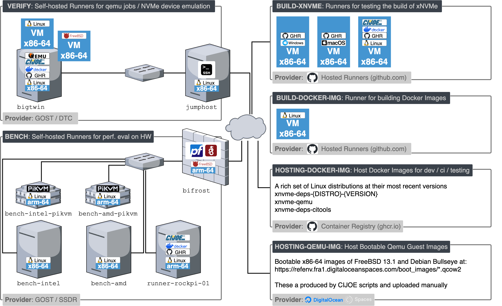

.. _sec-ci:

####
 CI
####

An overview of the environments and the virtual, and physical resources
utilized for the **xNVMe** **CI** is illustrated below.

   **xNVMe** **CI** environments and resources

The above figure is outdated, as **bench** and **verify** have been migrated
to a MaaS provider and are no longer on-premises. However, one system remains
on-prem because no MaaS provider currently offers a suitable replacement.

.. _sec-ci-infrastructure:

Infrastructure
##############

The main logical infrastructure component for the **xNVMe** **CI** is `GitHub
Actions`_ (**GHA**). **GHA** handles **events** occuring on the following
repositories:

* https://github.com/xnvme/xnvme/
* https://github.com/xnvme/xnvme.github.io
* https://github.com/xnvme/xnvme-docker
* https://github.com/xnvme/dpdk-windows-drivers

And decides what to execute and where. In other words **GHA** is utilized as a
**resource-scheduler** and **pipeline-engine**. The **executor** role is
delegated to `CIJOE`_ for details, then have a look at `CIJOE in xNVMe`_.

The motivation for this separation is to make it simpler to reproduce build,
test, and verfication issues occuring during a **CI** run, using locally
available resources, by executing the `CIJOE in xNVMe`_ workflows and scripts.

.. _sec-ci-jobs:

Jobs
####

The jobs performed by the **xNVMe** **CI** catch the following issues during
integration of changes / contributions:

* Code format issues

  - Linting and code-formating
  - clang-format for C
  - clippy for Rust
  - black / ruff for Python

* Build issues

  - Build with debug enabled and disabled
  - Detect linking issues with both the static and shared library
  - Tested on every OS listed in the :ref:`sec-toolchain` section
  
* Functional regressions

  - Running logical tests exercising all code-paths
  - Using a naive "ramdisk" backend
  - Using emulated NVMe devices via qemu
  - Using physical machines

In addition to cathing issues, then the CI is also utilized for:

* Benchmarking of **xNVMe**

  - Using physical machines
  - Measure peak IOPS for a single physical CPU core
  - Specifically for the integration of **xNVMe** in SPDK (``bdev_xnvme``)

* Statically Analyze the C code-base

  - CodeQL via GitHub
  - Coverity

* Produce and deploy documentation

  - Run all example commands (``.cmd`` files) and collect their output in
    ``.out`` files
  - Render the Sphinx-doc documentation as **HTML**
  - Upload rendered documentation to `xnvme.io via GitHub-pages`_

These following sections provide system-setup notes and other details for the
various **CI** jobs.

.. _sec-ci-environments:

Containers and guest images
###########################

Two of the **CI** jobs run inside a Docker host container (set by **GHA**'s
``container:`` directive), and several boot a **QEMU** guest as part of their
work. Both come from `nosi`_, which publishes base images as **OCI** artifacts
on **GHCR**.

* **Host containers** carry the toolchain the **GHA** job itself uses: **QEMU**
  binaries, **CIJOE**, devbind / hugepages helpers.

* **Guest disk images** are the qcow2 boot disk the in-job **QEMU** instance
  runs. They are pulled in-job by the ``stage_nosi_guest`` **CIJOE** script
  (invoked from ``provision-using-tgz.yaml`` and ``provision-maas-using-tgz
  .yaml`` right before ``guest_initialize``), which talks directly to the
  **OCI** Distribution API via stdlib ``urllib`` (no ``oras`` CLI dependency);
  the blob digest is pinned in each **CIJOE** config's ``[guest_image].url``.
  The nosi guests ship with root locked and an operator account ``odus``;
  ``cijoe/scripts/root_unlock.py`` runs right after ``guest_start`` to open
  root **SSH** so the rest of the **CIJOE** workflow continues as root unchanged
  (Linux uses ``chpasswd`` + ``systemctl``, FreeBSD uses ``pw usermod`` +
  ``service sshd reload``).

.. list-table:: Per-job container + guest-image inventory
   :header-rows: 1
   :widths: 28 32 32

   * - Job
     - Host container
     - Guest disk image
   * - ``verify (debian, trixie)``
     - ``safl/nosi/ubuntu-2604-docker`` (upstream QEMU + CIJOE)
     - ``safl/nosi/debian-13-headless``
   * - ``verify (debian, trixie-noiommu)``
     - ``safl/nosi/ubuntu-2604-docker`` (upstream QEMU + CIJOE)
     - ``safl/nosi/debian-13-headless``
   * - ``verify (freebsd, 14)``
     - ``safl/nosi/ubuntu-2604-docker`` (upstream QEMU + CIJOE)
     - ``safl/nosi/freebsd-14-headless``
   * - ``verify-maas (debian, trixie)``
     - n/a (self-hosted MAAS runner)
     - ``safl/nosi/debian-13-headless``
   * - ``benchmark-bdev_xnvme``
     - n/a (self-hosted MAAS runner)
     - ``safl/nosi/debian-13-headless``
   * - ``benchmark-latency (linux)``
     - n/a (self-hosted MAAS runner)
     - ``safl/nosi/debian-13-headless``
   * - ``benchmark-latency (freebsd)``
     - n/a (self-hosted MAAS runner)
     - ``safl/nosi/freebsd-14-headless``
   * - ``docgen``
     - ``safl/nosi/ubuntu-2604-docker`` (upstream QEMU + CIJOE)
     - ``safl/nosi/debian-13-headless``

All container-hosted jobs now run on the nosi ``ubuntu-2604-docker`` image
with upstream **QEMU**; the NVMe KV command set is supplied by
`vfio-user-kvssd`_ over **vfio-user**. The MAAS jobs run directly on
bare-metal hardware so do not need a host container.

.. toctree::
   :maxdepth: 2
   :hidden:
   :includehidden:

   runners/hetzner-setup/index.rst
   runners/onpremise/index.rst
   misc/index.rst

.. _CIJOE in xNVMe: https://github.com/xnvme/xnvme/tree/main/cijoe
.. _CIJOE: https://cijoe.readthedocs.io
.. _GitHub Actions: https://github.com/features/actions
.. _nosi: https://github.com/safl/nosi
.. _vfio-user-kvssd: https://github.com/safl/vfio-user-kvssd
.. _xnvme.io via GitHub-pages: https://github.com/xnvme/xnvme.github.io
