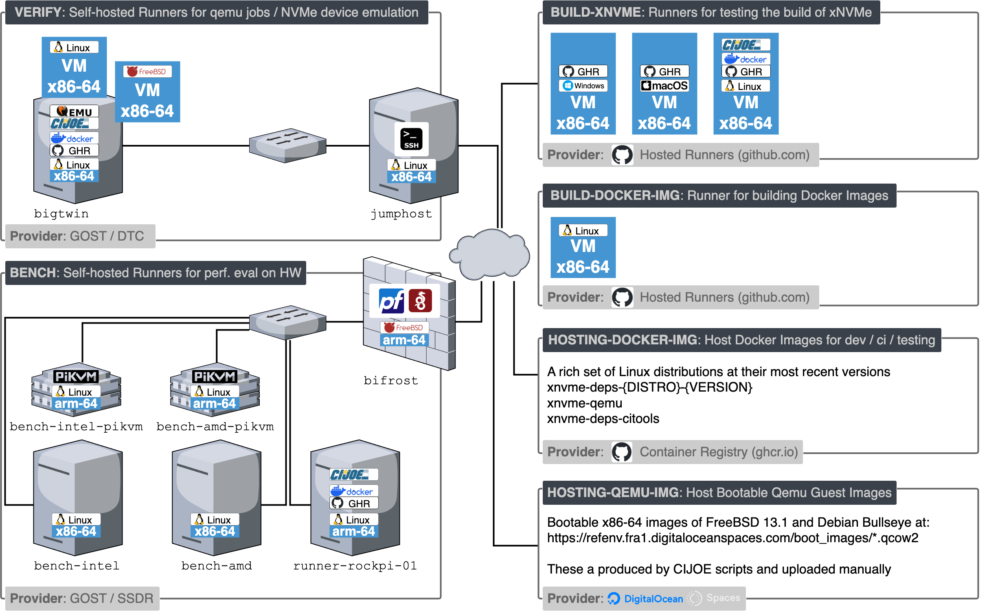

.. _sec-ci-verify:

Verify
######

   xNVMe **CI** environments and resources

.. _sec-ci-verify-runner:

GitHUB Runner
=============

Switch to the ``ghr`` user, go into the ``/ghr`` mountpoint, download and
extract the github-action-runner:

.. code-block:: bash

    su ghr
    cd /scratch/ghr/openmpdk/xnvme/runners
    mkdir actions-runner && cd actions-runner
    curl -o actions-runner-linux-x64-2.310.2.tar.gz -L https://github.com/actions/runner/releases/download/v2.310.2/actions-runner-linux-x64-2.310.2.tar.gz
    echo "fb28a1c3715e0a6c5051af0e6eeff9c255009e2eec6fb08bc2708277fbb49f93  actions-runner-linux-x64-2.310.2.tar.gz" | shasum -a 256 -c
    tar xzf ./actions-runner-linux-x64-2.310.2.tar.gz

Then we create twelve runners:

.. code-block:: bash

    export RUNNER_COUNT=12
    export RUNNERS=$(seq -f "runner-for-verify-%02g" 1 ${RUNNER_COUNT})
    export RUNNER_USER=ghr
    export URL=https://github.com/xnvme/xnvme
    export TOKEN={SUPER_SECRET}

With the above defined, then you can execute these:

.. code-block:: bash

   cd /scratch/ghr/openmpdk/xnvme/runners

   # Setup runners
   for RUNNER_NAME in $RUNNERS; do cp -r actions-runner $RUNNER_NAME; done;

   # Register runners
   for RUNNER_NAME in $RUNNERS; do pushd $RUNNER_NAME; ./config.sh --unattended --url $URL --token $TOKEN --labels verify --replace --name $RUNNER_NAME; popd; done

Install and run them as a service:

.. code-block:: bash

    cd /scratch/ghr/openmpdk/xnvme/runners

    # Service(s): install
    for RUNNER_NAME in $RUNNERS; do pushd $RUNNER_NAME; sudo ./svc.sh install $RUNNER_USER; popd; done

    # Service(s): start
    for RUNNER_NAME in $RUNNERS; do pushd $RUNNER_NAME; sudo ./svc.sh start; popd; done

    # Service(s): status
    for RUNNER_NAME in $RUNNERS; do pushd $RUNNER_NAME; sudo ./svc.sh status; popd; done

And when needing to update:

.. code-block:: bash

    # Services: stop
    for RUNNER_NAME in $RUNNERS; do pushd $RUNNER_NAME; sudo ./svc.sh stop; popd; done

    # Services: uninstall
    for RUNNER_NAME in $RUNNERS; do pushd $RUNNER_NAME; sudo ./svc.sh uninstall; popd; done

    # Remove the runner
    for RUNNER_NAME in $RUNNERS; do pushd $RUNNER_NAME; ./config.sh remove --token $TOKEN; popd; done;
