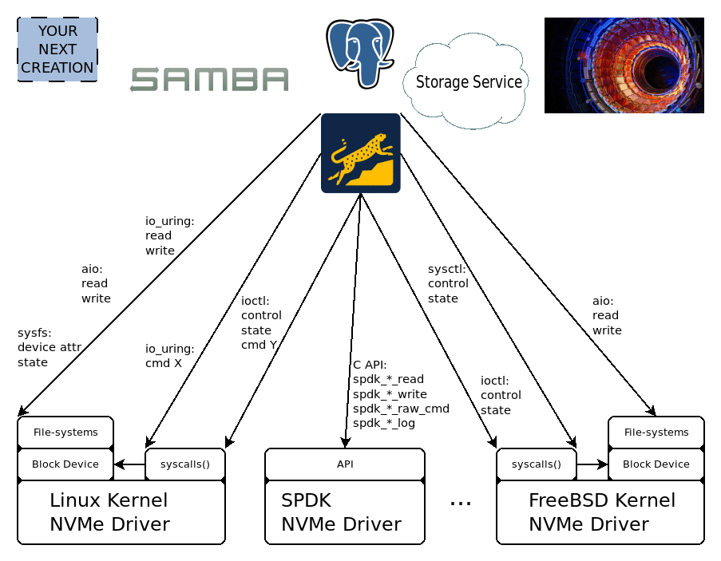

=====================================================
 Cross-platform libraries and tools for NVMe devices
=====================================================

.. _devenv:

   A single unified API across platforms, systems, and APIs. Reduce your
   code-complexity from  ``n * m`` (where ``n`` is the number of platforms and
   ``m`` are the number of I/O interfaces on the platform.) to ``1``.

**xNVMe** provides the means to program and interact with NVMe devices from
user space.

The foundation of **xNVMe** is ``libxnvme``, a user space library for working
with NVMe devices. It provides a **C API** for memory management, that is, for
allocating physical / DMA transferable memory when needed. An NVMe command
interface allowing you to submit and complete NVMe commands in a synchronous as
well as an asynchronous manner.

Convenience functions are built-in for common operations and retrieving
parameters essential for I/O applications. Such as your maximum data transfer
size and introducing the concept of a device geometry.

The foundation is as such fairly low-level, sitting right on top of a NVMe
driver. The actual NVMe driver being used by ``libxnvme`` is re-targetable and
can be any one of the GNU/Linux Kernel NVMe driver via ``libaio``, ``IOCTLs``,
and ``io_uring``, the SPDK NVMe driver, or your own custom NVMe driver.

As such, ``libxnvme`` provides a unifying ``C API`` for NVMe tool builders,
application developers, and for anyone wanting their host-defined software to
run on more than a single platform.

On top of ``libxnvme`` a suite of tools and libraries are provided, that is, a
command-line interface for managing your NVMe device named ``xnvme``, and
``lblk`` for commands specific to NVM Namespaces.

For the Zoned Command Set a command-line interface designed specifically for
convenient management of Zoned NVMe devices named ``zoned`` and a C API
``libxnvme_znd.h``.

To evaluate the performance of abstractions introduced by ``xNVMe`` a Fio IO
engine is provided, supporting **conventional** NVMe devices, as well as
**Zoned** devices.

Jump right into the :ref:`sec-gs` and with the basics in place you can explore
the :ref:`sec-tools` and the :ref:`sec-api`.

Contents:

.. toctree::
   :maxdepth: 2
   :includehidden:

   getting_started/index.rst
   toolchain/index.rst
   backends/index.rst
   tools/index.rst
   api/index.rst
   tutorial/index.rst
   material/index.rst
   contributing/index.rst

Indices and tables
==================

* :ref:`genindex`
* :ref:`modindex`
* :ref:`search`
