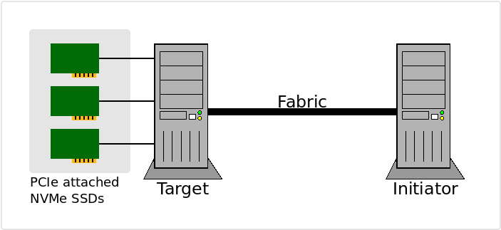

.. _sec-tutorials-fabrics:

===================
 NVMe-over-Fabrics
===================

NVMe supports multiple transports_, **PCIe** for locally attached devices,
**TCP** and **RDMA** (iWRAP, InifiniBand, RoCE) for access over a networked
fabric. The use of NVMe over a networked fabrics is defined by the NVMe-oF_
specfication and often referred to a NVMe-over-Fabrics or just **fabrics**.

In a fabrics setup, one machine typically has a bunch of NVMe devices attached
via PCIe, these are then **exported** aka made accessible over a networked
fabric, we refer to the system/machine with this role as the fabrics
**target**. The systems/machines consuming the exported devices over the
networked fabric are referred to as the fabric **initiator**. The figure below
is an attempt to visualize these roles.

   Roles in a NVMe-oF/NVMe-over-Fabrics/Fabrics setup

This will guide you through the setup of:

1. A machine to act as the Fabrics **target**

   * Example showing how to export using the Linux kernel
   * Example showing how to export using SPDK

2. A machine to act as a Fabrics **initiator**

   * Example showing how to Utilize the exported endpoints using **xNVMe**

The following section will describe the setup and define the environment.

Fabrics Setup
=============

In the setup **TCP** will be used as the transport. It is quite convenient as
allows you to work with fabrics using non-RDMA network devices, that is, this
setup is possible using commodity hardware.
Additonally a locally attached NVMe PCIe SSD is exported on the **target**. It
is available on the system in ``/dev/nvme0n1`` and it has PCIe identifier
``0000:03:00.0``.

It is assumed that both the **initiator**, as well as the **target**, are
running Debian Linux / Bullseye and that **xNVMe** is installed according to
the :ref:`sec-getting-started` section. Additonally, the **xNVMe** source repos
is available at ``${XNVME_REPOS}``.

When running the commands/scripts in the following sections, then it is assumed
that you are running ``root``. Needless to say, then this is a guide is not
focused on security/access-control.

Start by defining your fabrics setup using the following environment variables:

.. literalinclude:: fabrics_env.sh
   :language: bash
   :lines: 5-

Adjust the definitions above to match your setup, the various entities will be
used in both the **target** and the **initiator**. Run the above commands or
edit and run: ``${XNVME_REPOS}/docs/tutorial/fabrics/fabrics_env.sh``.

Target Setup
============

Here two approaches to setting up a **target** is provided. The first approach
shows how to setup the fabrics **target** using Linux Kernel via ``sysfs``. The
second approac shows how to it using **SPDK**. In both cases we need to load
the following Kernel modules:

.. literalinclude:: fabrics_target_modules.sh
   :language: bash
   :lines: 3-

Exporting Targets using the Kernel
----------------------------------

With the variables defined, then the following will export the NVMe device at
``/dev/nvme0n1`` over fabrics using TCP transport:

.. literalinclude:: fabrics_target_linux.sh
   :language: bash
   :lines: 6-

Or, by running the script:
``${XNVME_REPOS}/docs/tutorial/fabrics/fabrics_target_linux.sh``

Exporting Targets using SPDK
----------------------------

Assuming that you have build and installed **xNVMe** as described in the
:ref:`sec-getting-started` section, then you have the **xNVMe** repository
available. We will be using the **SPDK** subproject from it, as it is already
build and available for use.

Then run the following:

.. literalinclude:: fabrics_target_spdk.sh
   :language: bash
   :lines: 6-

Or, by running the script:
``${XNVME_REPOS}/docs/tutorial/fabrics/fabrics_target_spdk.sh``

.. note:: For additional documentation on the setup of fabrics using SPDK, then
   consult the SPDK documentation on SPDK-NVMe-oF_, it has more details and
   pointers on SPDK specifics and a nice description of the ``NQN`` definition.

Initiator Setup
===============

For the **initiator** setup, load the required Kernel modules by invoking the
following:

.. literalinclude:: fabrics_initiator_modules.sh
   :language: bash
   :lines: 3-

Or, by running the script:
``${XNVME_REPOS}/docs/tutorial/fabrics/fabrics_initiator_modules.sh``.

Use via **xNVMe**
-----------------

Connect to the exported fabrics endpoint using **xNVMe**:

.. literalinclude:: fabrics_initiator_xnvme.sh
   :language: bash
   :lines: 9-

Or, by running the script:
``${XNVME_REPOS}/docs/tutorial/fabrics/fabrics_initiator_xnvme.sh``.

Use via **nvme-cli**
--------------------

Connect to the exported fabrics endpoint using **nvme-cli**:

.. literalinclude:: fabrics_initiator_nvmecli.sh
   :language: bash
   :lines: 9-

Or, by running the script:
``${XNVME_REPOS}/docs/tutorial/fabrics/fabrics_initiator_nvmecli.sh``

.. _SPDK-NVMe-oF: https://spdk.io/doc/nvmf.html
.. _transports: https://nvmexpress.org/developers/nvme-transport-specifications/
.. _NVMe-oF: https://nvmexpress.org/developers/nvme-transport-specifications/
